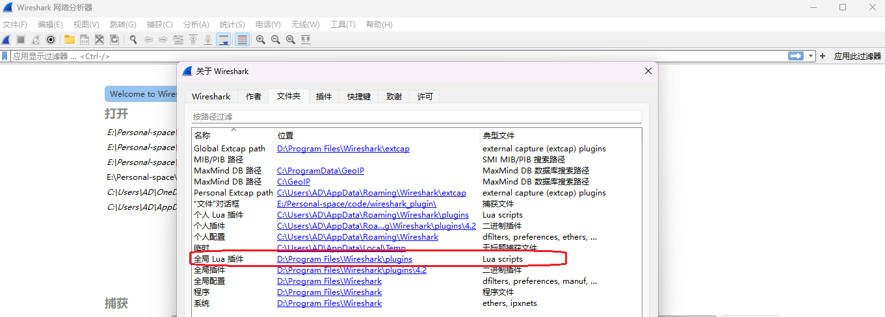

[TOC]

# 安装和使用

**查看lua插件安装路径**

```
帮助 -> 关于wireshark -> 全局lua插件
```


<br/>

## Linux
``` shell
sudo ln -s  $(pwd)/lan_sync_proto.lua /usr/lib/x86_64-linux-gnu/wireshark/plugins/lan_sync_proto.lua
sudo cp lan_sync_proto.lua /usr/lib/x86_64-linux-gnu/wireshark/plugins/lan_sync_proto.lua
```

<br/>

## Windwos

修改 wireshark_home 下的init.lua, 确保开启了lua，即如下代码
``` lua
disable_lua = false
```

拷贝插件到“全局lua插件”目录下

``` shell
cp lan_sync_proto.lua  D:/Program Files/Wireshark/plugins/2.0.1
```
<br/>

## 使用
- 方式1： ctrl + shift + L 刷新插件
- 方式2： 分析 -> 重新载入lua插件

<br/>

# 开发

## api

wireshark lua api : 

https://gitlab.com/wireshark/wireshark/-/wikis/uploads/04a18cffc1ba39292e97a99252d93416/220711_wslua_Index_DRAFT.pdf

<br/>

wireshark lua example : 

https://wiki.wireshark.org/Lua/Examples